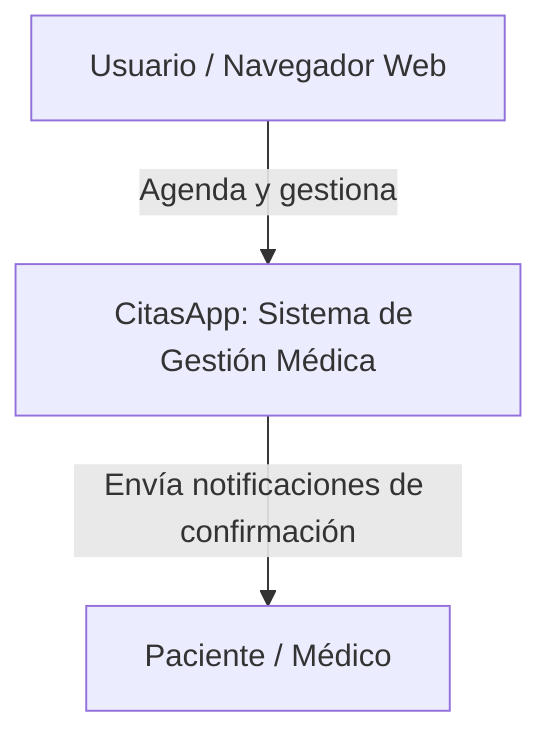
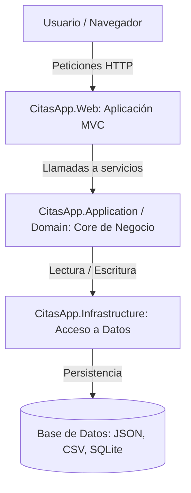

# Documentación Arquitectónica C4 - CitasApp

### C4 Nivel 1 - Contexto
**Para quién es:** Para cualquier persona, incluyendo clientes, profesores o equipo no técnico.
**Qué pregunta responde:** ¿Qué es el sistema CitasApp y quién interactúa con él a gran escala?

---

### C4 Nivel 2 - Contenedores
**Para quién es:** Para el equipo técnico, desarrolladores de software y arquitectos.
**Qué pregunta responde:** ¿Cuáles son las piezas principales (aplicación Web, Core de negocio, Infraestructura) y cómo se comunican entre ellas?

