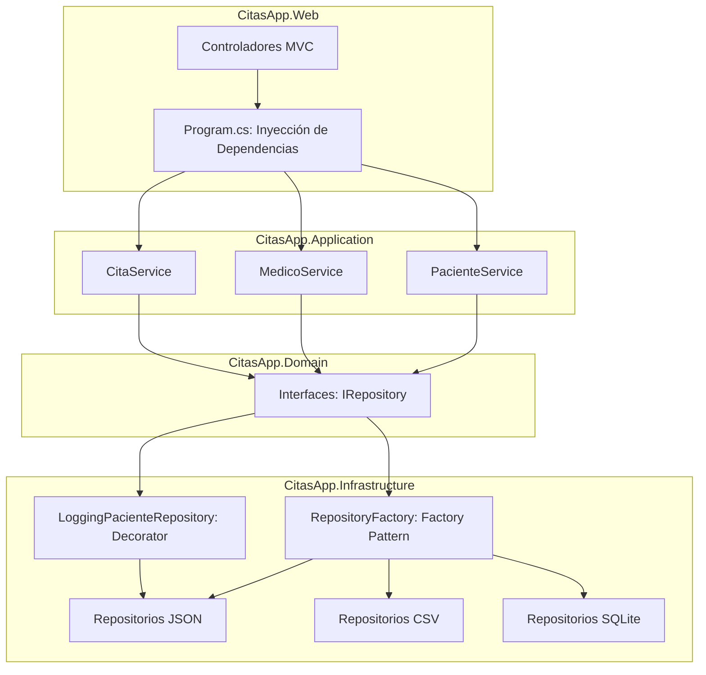

# Documentación Arquitectónica - CitasApp
Este diagrama refleja la arquitectura interna del sistema, estructurada en capas (Domain, Application, Infrastructure) y la aplicación de los patrones de diseño GoF (Factory, Decorator).

---

### Declaración de Uso de IA
Para la elaboración de esta documentación, utilicé asistencia de inteligencia artificial (Gemini) exclusivamente como herramienta de apoyo para generar y estructurar la sintaxis de los diagramas Mermaid. El diseño, la definición de las capas arquitectónicas y la implementación de los patrones GoF documentados están basados al 100% en el código fuente de mi autoría en el proyecto CitasApp.