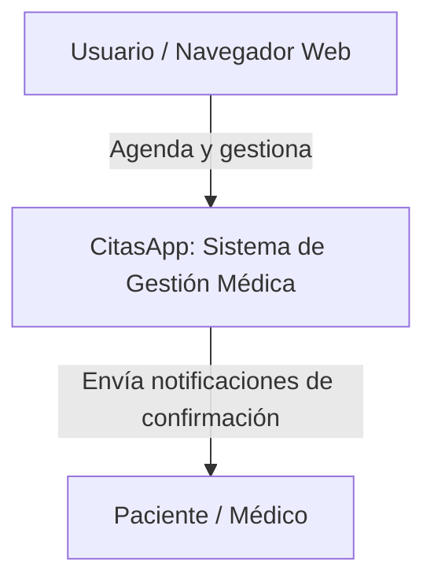
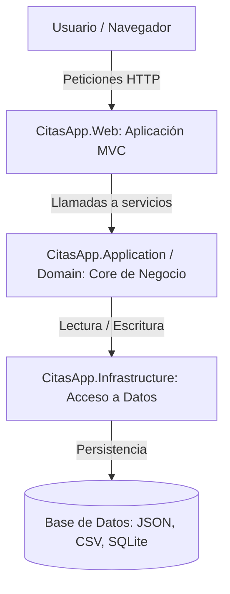
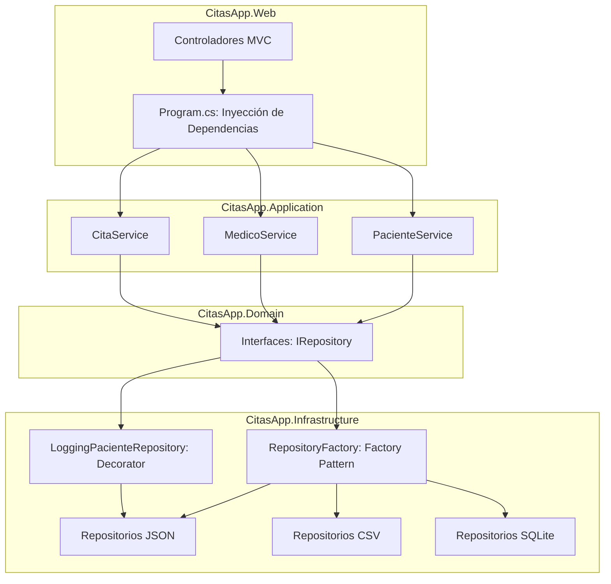

# Documentación Arquitectónica C4 - CitasApp

### C4 Nivel 1 - Contexto
**Para quién es:** Para cualquier persona, incluyendo clientes, profesores o equipo no técnico.
**Qué pregunta responde:** ¿Qué es el sistema CitasApp y quién interactúa con él a gran escala?

---

### C4 Nivel 2 - Contenedores
**Para quién es:** Para el equipo técnico, desarrolladores de software y arquitectos.
**Qué pregunta responde:** ¿Cuáles son las piezas principales (aplicación Web, Core de negocio, Infraestructura) y cómo se comunican entre ellas?

---

### C4 Nivel 3 - Componentes
**Para quién es:** Para los programadores que van a tocar y modificar el código directamente.
**Qué pregunta responde:** ¿Cómo están estructuradas las capas internas (Domain, Application, Infrastructure) y dónde están aplicados los patrones GoF (Factory, Decorator) dentro de la pieza principal?

---

### Declaración de Uso de IA
Para la elaboración de esta documentación, utilicé asistencia de inteligencia artificial (Gemini) exclusivamente como herramienta de apoyo para generar y estructurar la sintaxis de los diagramas Mermaid. El diseño, la definición de las capas arquitectónicas y la implementación de los patrones GoF documentados están basados al 100% en el código fuente de mi autoría en el proyecto CitasApp.